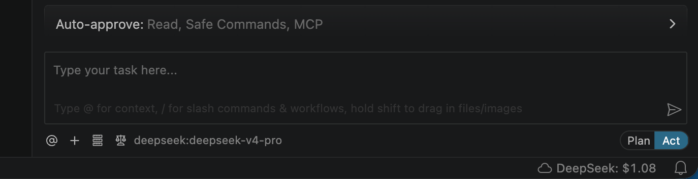

# BYOK DeepSeek Credits

View your **DeepSeek API balance and usage** directly in the VS Code status bar — no browser, no dashboard, no context switching.

> Not affiliated with or endorsed by DeepSeek.



---

## Features

- **Live balance in the status bar** — shows your remaining DeepSeek credit, e.g. `☁ DeepSeek $4.82`
- **Secure API key storage** — your key is stored in VS Code's encrypted `SecretStorage`, never in `settings.json`
- **Auto-refresh** — balance refreshes automatically on a configurable interval (default: every 30 minutes)
- **Manual refresh** — run `BYOK DeepSeek Credits: Refresh Balances` any time from the Command Palette
- **Click to open billing** — clicking the status bar item opens the DeepSeek usage page in your browser

---

## Getting Started

### 1. Get a DeepSeek API key

Sign in at [platform.deepseek.com/api_keys](https://platform.deepseek.com/api_keys) and create a key.

### 2. Set the key in VS Code

Open the Command Palette (`Cmd+Shift+P` / `Ctrl+Shift+P`) and run:

```
BYOK DeepSeek Credits: Set API Key
```

Paste your API key when prompted. The status bar will update immediately.

---

## Extension Settings

| Setting | Default | Description |
|---|---|---|
| `byokDeepSeekCredits.providers.deepseek.enabled` | `true` | Show/hide the DeepSeek status bar item |
| `byokDeepSeekCredits.refreshIntervalMinutes` | `30` | Auto-refresh interval in minutes |

---

## Commands

| Command | Description |
|---|---|
| `BYOK DeepSeek Credits: Set API Key` | Enter or update your DeepSeek API key |
| `BYOK DeepSeek Credits: Refresh Balances` | Manually refresh the balance |

---

## Status Bar Icons

| Display | Meaning |
|---|---|
| `☁ DeepSeek $4.82` | Balance fetched successfully |
| `🔑 DeepSeek` | API key not set yet |
| `⚠ DeepSeek` | Fetch failed (hover for details) |

---

## Release Notes

### 0.0.1

Initial release — DeepSeek balance in the status bar with secure key storage and auto-refresh.
